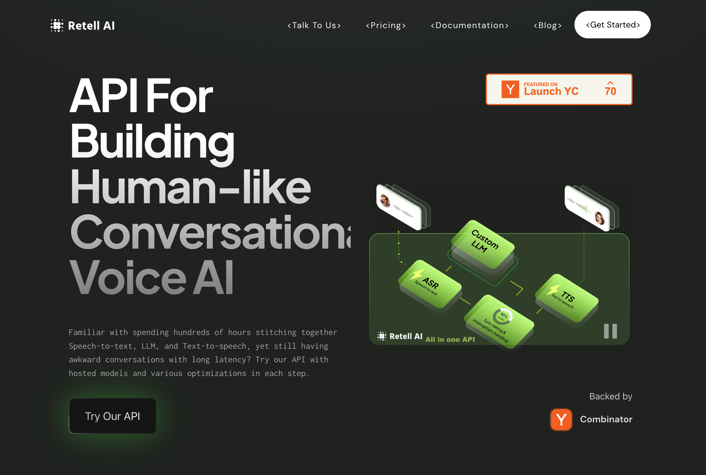

<div align="left">

[](https://retellai.com)

# Retell ai<a id="retell-ai"></a>

API for voice AI. Effortlessly integrate human-like Voice AI into your product. | We are building an API that enables your product to provide an intuitive and engaging way for user interaction - through voice.


</div>

## Table of Contents<a id="table-of-contents"></a>

<!-- toc -->

- [Requirements](#requirements)
- [Installation](#installation)
- [Getting Started](#getting-started)
- [Async](#async)
- [Raw HTTP Response](#raw-http-response)
- [Reference](#reference)
  * [`retellai.agent.create_new_agent`](#retellaiagentcreate_new_agent)
  * [`retellai.agent.delete_existing_agent`](#retellaiagentdelete_existing_agent)
  * [`retellai.agent.get_all`](#retellaiagentget_all)
  * [`retellai.agent.get_details`](#retellaiagentget_details)
  * [`retellai.agent.update_existing_agent`](#retellaiagentupdate_existing_agent)
  * [`retellai.call.establish_connection`](#retellaicallestablish_connection)
  * [`retellai.call.get_details`](#retellaicallget_details)
  * [`retellai.call.get_details_0`](#retellaicallget_details_0)
  * [`retellai.call.make_connection`](#retellaicallmake_connection)
  * [`retellai.phone_number.get_all_numbers`](#retellaiphone_numberget_all_numbers)
  * [`retellai.phone_number.get_details`](#retellaiphone_numberget_details)
  * [`retellai.phone_number.purchase_number_and_bind_agent`](#retellaiphone_numberpurchase_number_and_bind_agent)
  * [`retellai.phone_number.remove_phone_number`](#retellaiphone_numberremove_phone_number)
  * [`retellai.phone_number.update_retell_llm`](#retellaiphone_numberupdate_retell_llm)
  * [`retellai.retell.delete_llm`](#retellairetelldelete_llm)
  * [`retellai.retell.get_llm_details`](#retellairetellget_llm_details)
  * [`retellai.retell.new_llm`](#retellairetellnew_llm)
  * [`retellai.retell.update_llm`](#retellairetellupdate_llm)
  * [`retellai.retell_llm.list_all`](#retellairetell_llmlist_all)

<!-- tocstop -->

## Requirements<a id="requirements"></a>

Python >=3.7

## Installation<a id="installation"></a>
<div align="center">
  <a href="https://konfigthis.com/sdk-sign-up?company=Retell%20AI&language=Python">
    
  </a>
</div>

## Getting Started<a id="getting-started"></a>

```python
from pprint import pprint
from retell_ai_python_sdk import RetellAi, ApiException

retellai = RetellAi(access_token="YOUR_BEARER_TOKEN")

try:
    create_new_agent_response = retellai.agent.create_new_agent(
        body=None,
        llm_websocket_url="wss://your-websocket-endpoint",
        voice_id="11labs-Adrian",
        voice_temperature=1,
        voice_speed=1,
        responsiveness=1,
        enable_backchannel=True,
        ambient_sound="coffee-shop",
        agent_name="Jarvis",
        language="en-US",
        webhook_url="https://webhook-url-here",
        boosted_keywords=["retell", "kroger"],
        format_text=True,
        opt_out_sensitive_data_storage=True,
    )
    print(create_new_agent_response)
except ApiException as e:
    print("Exception when calling AgentApi.create_new_agent: %s\n" % e)
    pprint(e.body)
    if e.status == 400:
        pprint(e.body["error_message"])
    if e.status == 422:
        pprint(e.body["error_message"])
    if e.status == 401:
        pprint(e.body["error_message"])
    if e.status == 500:
        pprint(e.body["error_message"])
    pprint(e.headers)
    pprint(e.status)
    pprint(e.reason)
    pprint(e.round_trip_time)
```

## Async<a id="async"></a>

`async` support is available by prepending `a` to any method.

```python
import asyncio
from pprint import pprint
from retell_ai_python_sdk import RetellAi, ApiException

retellai = RetellAi(access_token="YOUR_BEARER_TOKEN")


async def main():
    try:
        create_new_agent_response = await retellai.agent.acreate_new_agent(
            body=None,
            llm_websocket_url="wss://your-websocket-endpoint",
            voice_id="11labs-Adrian",
            voice_temperature=1,
            voice_speed=1,
            responsiveness=1,
            enable_backchannel=True,
            ambient_sound="coffee-shop",
            agent_name="Jarvis",
            language="en-US",
            webhook_url="https://webhook-url-here",
            boosted_keywords=["retell", "kroger"],
            format_text=True,
            opt_out_sensitive_data_storage=True,
        )
        print(create_new_agent_response)
    except ApiException as e:
        print("Exception when calling AgentApi.create_new_agent: %s\n" % e)
        pprint(e.body)
        if e.status == 400:
            pprint(e.body["error_message"])
        if e.status == 422:
            pprint(e.body["error_message"])
        if e.status == 401:
            pprint(e.body["error_message"])
        if e.status == 500:
            pprint(e.body["error_message"])
        pprint(e.headers)
        pprint(e.status)
        pprint(e.reason)
        pprint(e.round_trip_time)


asyncio.run(main())
```

## Raw HTTP Response<a id="raw-http-response"></a>

To access raw HTTP response values, use the `.raw` namespace.

```python
from pprint import pprint
from retell_ai_python_sdk import RetellAi, ApiException

retellai = RetellAi(access_token="YOUR_BEARER_TOKEN")

try:
    create_new_agent_response = retellai.agent.raw.create_new_agent(
        body=None,
        llm_websocket_url="wss://your-websocket-endpoint",
        voice_id="11labs-Adrian",
        voice_temperature=1,
        voice_speed=1,
        responsiveness=1,
        enable_backchannel=True,
        ambient_sound="coffee-shop",
        agent_name="Jarvis",
        language="en-US",
        webhook_url="https://webhook-url-here",
        boosted_keywords=["retell", "kroger"],
        format_text=True,
        opt_out_sensitive_data_storage=True,
    )
    pprint(create_new_agent_response.body)
    pprint(create_new_agent_response.headers)
    pprint(create_new_agent_response.status)
    pprint(create_new_agent_response.round_trip_time)
except ApiException as e:
    print("Exception when calling AgentApi.create_new_agent: %s\n" % e)
    pprint(e.body)
    if e.status == 400:
        pprint(e.body["error_message"])
    if e.status == 422:
        pprint(e.body["error_message"])
    if e.status == 401:
        pprint(e.body["error_message"])
    if e.status == 500:
        pprint(e.body["error_message"])
    pprint(e.headers)
    pprint(e.status)
    pprint(e.reason)
    pprint(e.round_trip_time)
```


## Reference<a id="reference"></a>
### `retellai.agent.create_new_agent`<a id="retellaiagentcreate_new_agent"></a>

Create a new agent

#### 🛠️ Usage<a id="🛠️-usage"></a>

```python
create_new_agent_response = retellai.agent.create_new_agent(
    body=None,
    llm_websocket_url="wss://your-websocket-endpoint",
    voice_id="11labs-Adrian",
    voice_temperature=1,
    voice_speed=1,
    responsiveness=1,
    enable_backchannel=True,
    ambient_sound="coffee-shop",
    agent_name="Jarvis",
    language="en-US",
    webhook_url="https://webhook-url-here",
    boosted_keywords=["retell", "kroger"],
    format_text=True,
    opt_out_sensitive_data_storage=True,
)
```

#### ⚙️ Parameters<a id="⚙️-parameters"></a>

##### llm_websocket_url: `str`<a id="llm_websocket_url-str"></a>

The URL we will establish LLM websocket for getting response, usually your server. Check out [LLM WebSocket](https://raw.githubusercontent.com) for more about request format (sent from us) and response format (send to us).

##### voice_id: `str`<a id="voice_id-str"></a>

Unique voice id used for the agent. Find list of available voices and their preview in Dashboard.

##### voice_temperature: `Union[int, float]`<a id="voice_temperature-unionint-float"></a>

Controls how stable the voice is. Value ranging from [0,2]. Lower value means more stable, and higher value means more variant speech generation. Currently this setting only applies to `11labs` voices. If unset, default value 1 will apply.

##### voice_speed: `Union[int, float]`<a id="voice_speed-unionint-float"></a>

Controls speed of voice. Value ranging from [0.5,2]. Lower value means slower speech, while higher value means faster speech rate. If unset, default value 1 will apply.

##### responsiveness: `Union[int, float]`<a id="responsiveness-unionint-float"></a>

Controls how responsive is the agent. Value ranging from [0,1]. Lower value means less responsive agent (wait more, respond slower), while higher value means faster exchanges (respond when it can). If unset, default value 1 will apply.

##### enable_backchannel: `bool`<a id="enable_backchannel-bool"></a>

Controls whether the agent would backchannel (agent interjects the speaker with phrases like \\\"yeah\\\", \\\"uh-huh\\\" to signify interest and engagement). Backchannel when enabled tends to show up more in longer user utterances. If not set, agent will not backchannel.

##### ambient_sound: `str`<a id="ambient_sound-str"></a>

If set, will add ambient environment sound to the call to make experience more realistic. Currently supports the following options:  - `coffee-shop`: Coffee shop ambience with people chatting in background. [Listen to Ambience](https://retell-utils-public.s3.us-west-2.amazonaws.com/coffee-shop.wav)  - `convention-hall`: Convention hall ambience, with some echo and people chatting in background. [Listen to Ambience](https://retell-utils-public.s3.us-west-2.amazonaws.com/convention-hall.wav)  - `summer-outdoor`: Summer outdoor ambience with cicada chirping. [Listen to Ambience](https://retell-utils-public.s3.us-west-2.amazonaws.com/summer-outdoor.wav)  - `mountain-outdoor`: Mountain outdoor ambience with birds singing. [Listen to Ambience](https://retell-utils-public.s3.us-west-2.amazonaws.com/mountain-outdoor.wav)   Set to string `null` to remove ambient sound from this agent. 

##### agent_name: `str`<a id="agent_name-str"></a>

The name of the agent. Only used for your own reference.

##### language: `str`<a id="language-str"></a>

`Beta feature, use with caution.`   This setting specifies the agent's operational language, including base language and dialect. Speech recognition considers both elements, but text-to-speech currently only recognizes the base language.    For instance, selecting `en-GB` optimizes speech recognition for British English, yet text-to-speech output will be in standard English. If dialect-specific text-to-speech is required, please contact us for support.   - `11lab voices`: supports English(en), German(de), Spanish(es), Hindi(hi), Portuguese(pt)   - `openAI voices`: supports English(en), German(de), Spanish(es), Hindi(hi), Portuguese(pt), Japanese(ja)   - `deepgram voices`: supports English(en) 

##### webhook_url: `str`<a id="webhook_url-str"></a>

The webhook for agent to listen to call events. See what events it would get at [webhook doc](https://raw.githubusercontent.com). If set, will binds webhook events for this agent to the specified url, and will ignore the account level webhook for this agent. Set to string `null` to remove webhook url from this agent.

##### boosted_keywords: [`BaseAgentBoostedKeywords`](./retell_ai_python_sdk/type/base_agent_boosted_keywords.py)<a id="boosted_keywords-baseagentboostedkeywordsretell_ai_python_sdktypebase_agent_boosted_keywordspy"></a>

##### format_text: `bool`<a id="format_text-bool"></a>

Whether to format the transcribed text with inverse text normalization. It transforms the spoken form of text into written form for entities like phone number, email address, street address, etc. For example, \\\"february fourth twenty twenty two\\\" can be converted into \\\"february 4th 2022\\\". If not set, the default is true.

##### opt_out_sensitive_data_storage: `bool`<a id="opt_out_sensitive_data_storage-bool"></a>

Disable transcripts and recordings storage for enhanced privacy. Access transcripts securely via webhooks.

#### ⚙️ Request Body<a id="⚙️-request-body"></a>

[`AgentCreateNewAgentRequest`](./retell_ai_python_sdk/type/agent_create_new_agent_request.py)
#### 🔄 Return<a id="🔄-return"></a>

[`AgentResponse`](./retell_ai_python_sdk/pydantic/agent_response.py)

#### 🌐 Endpoint<a id="🌐-endpoint"></a>

`/create-agent` `post`

[🔙 **Back to Table of Contents**](#table-of-contents)

---

### `retellai.agent.delete_existing_agent`<a id="retellaiagentdelete_existing_agent"></a>

Delete an existing agent

#### 🛠️ Usage<a id="🛠️-usage"></a>

```python
retellai.agent.delete_existing_agent(
    agent_id="oBeDLoLOeuAbiuaMFXRtDOLriTJ5tSxD",
)
```

#### ⚙️ Parameters<a id="⚙️-parameters"></a>

##### agent_id: `str`<a id="agent_id-str"></a>

Unique id of the agent to be deleted.

#### 🌐 Endpoint<a id="🌐-endpoint"></a>

`/delete-agent/{agent_id}` `delete`

[🔙 **Back to Table of Contents**](#table-of-contents)

---

### `retellai.agent.get_all`<a id="retellaiagentget_all"></a>

List all agents

#### 🛠️ Usage<a id="🛠️-usage"></a>

```python
get_all_response = retellai.agent.get_all()
```

#### 🔄 Return<a id="🔄-return"></a>

[`AgentGetAllResponse`](./retell_ai_python_sdk/pydantic/agent_get_all_response.py)

#### 🌐 Endpoint<a id="🌐-endpoint"></a>

`/list-agents` `get`

[🔙 **Back to Table of Contents**](#table-of-contents)

---

### `retellai.agent.get_details`<a id="retellaiagentget_details"></a>

Retrieve details of a specific agent

#### 🛠️ Usage<a id="🛠️-usage"></a>

```python
get_details_response = retellai.agent.get_details(
    agent_id="16b980523634a6dc504898cda492e939",
)
```

#### ⚙️ Parameters<a id="⚙️-parameters"></a>

##### agent_id: `str`<a id="agent_id-str"></a>

Unique id of the agent to be retrieved.

#### 🔄 Return<a id="🔄-return"></a>

[`AgentResponse`](./retell_ai_python_sdk/pydantic/agent_response.py)

#### 🌐 Endpoint<a id="🌐-endpoint"></a>

`/get-agent/{agent_id}` `get`

[🔙 **Back to Table of Contents**](#table-of-contents)

---

### `retellai.agent.update_existing_agent`<a id="retellaiagentupdate_existing_agent"></a>

Update an existing agent

#### 🛠️ Usage<a id="🛠️-usage"></a>

```python
update_existing_agent_response = retellai.agent.update_existing_agent(
    agent_id="16b980523634a6dc504898cda492e939",
    llm_websocket_url="wss://your-websocket-endpoint",
    voice_id="11labs-Adrian",
    voice_temperature=1,
    voice_speed=1,
    responsiveness=1,
    enable_backchannel=True,
    ambient_sound="coffee-shop",
    agent_name="Jarvis",
    language="en-US",
    webhook_url="https://webhook-url-here",
    boosted_keywords=["retell", "kroger"],
    format_text=True,
    opt_out_sensitive_data_storage=True,
)
```

#### ⚙️ Parameters<a id="⚙️-parameters"></a>

##### agent_id: `str`<a id="agent_id-str"></a>

Unique id of the agent to be updated.

##### llm_websocket_url: `str`<a id="llm_websocket_url-str"></a>

The URL we will establish LLM websocket for getting response, usually your server. Check out [LLM WebSocket](https://raw.githubusercontent.com) for more about request format (sent from us) and response format (send to us).

##### voice_id: `str`<a id="voice_id-str"></a>

Unique voice id used for the agent. Find list of available voices and their preview in Dashboard.

##### voice_temperature: `Union[int, float]`<a id="voice_temperature-unionint-float"></a>

Controls how stable the voice is. Value ranging from [0,2]. Lower value means more stable, and higher value means more variant speech generation. Currently this setting only applies to `11labs` voices. If unset, default value 1 will apply.

##### voice_speed: `Union[int, float]`<a id="voice_speed-unionint-float"></a>

Controls speed of voice. Value ranging from [0.5,2]. Lower value means slower speech, while higher value means faster speech rate. If unset, default value 1 will apply.

##### responsiveness: `Union[int, float]`<a id="responsiveness-unionint-float"></a>

Controls how responsive is the agent. Value ranging from [0,1]. Lower value means less responsive agent (wait more, respond slower), while higher value means faster exchanges (respond when it can). If unset, default value 1 will apply.

##### enable_backchannel: `bool`<a id="enable_backchannel-bool"></a>

Controls whether the agent would backchannel (agent interjects the speaker with phrases like \\\"yeah\\\", \\\"uh-huh\\\" to signify interest and engagement). Backchannel when enabled tends to show up more in longer user utterances. If not set, agent will not backchannel.

##### ambient_sound: `str`<a id="ambient_sound-str"></a>

If set, will add ambient environment sound to the call to make experience more realistic. Currently supports the following options:  - `coffee-shop`: Coffee shop ambience with people chatting in background. [Listen to Ambience](https://retell-utils-public.s3.us-west-2.amazonaws.com/coffee-shop.wav)  - `convention-hall`: Convention hall ambience, with some echo and people chatting in background. [Listen to Ambience](https://retell-utils-public.s3.us-west-2.amazonaws.com/convention-hall.wav)  - `summer-outdoor`: Summer outdoor ambience with cicada chirping. [Listen to Ambience](https://retell-utils-public.s3.us-west-2.amazonaws.com/summer-outdoor.wav)  - `mountain-outdoor`: Mountain outdoor ambience with birds singing. [Listen to Ambience](https://retell-utils-public.s3.us-west-2.amazonaws.com/mountain-outdoor.wav)   Set to string `null` to remove ambient sound from this agent. 

##### agent_name: `str`<a id="agent_name-str"></a>

The name of the agent. Only used for your own reference.

##### language: `str`<a id="language-str"></a>

`Beta feature, use with caution.`   This setting specifies the agent's operational language, including base language and dialect. Speech recognition considers both elements, but text-to-speech currently only recognizes the base language.    For instance, selecting `en-GB` optimizes speech recognition for British English, yet text-to-speech output will be in standard English. If dialect-specific text-to-speech is required, please contact us for support.   - `11lab voices`: supports English(en), German(de), Spanish(es), Hindi(hi), Portuguese(pt)   - `openAI voices`: supports English(en), German(de), Spanish(es), Hindi(hi), Portuguese(pt), Japanese(ja)   - `deepgram voices`: supports English(en) 

##### webhook_url: `str`<a id="webhook_url-str"></a>

The webhook for agent to listen to call events. See what events it would get at [webhook doc](https://raw.githubusercontent.com). If set, will binds webhook events for this agent to the specified url, and will ignore the account level webhook for this agent. Set to string `null` to remove webhook url from this agent.

##### boosted_keywords: [`BaseAgentBoostedKeywords`](./retell_ai_python_sdk/type/base_agent_boosted_keywords.py)<a id="boosted_keywords-baseagentboostedkeywordsretell_ai_python_sdktypebase_agent_boosted_keywordspy"></a>

##### format_text: `bool`<a id="format_text-bool"></a>

Whether to format the transcribed text with inverse text normalization. It transforms the spoken form of text into written form for entities like phone number, email address, street address, etc. For example, \\\"february fourth twenty twenty two\\\" can be converted into \\\"february 4th 2022\\\". If not set, the default is true.

##### opt_out_sensitive_data_storage: `bool`<a id="opt_out_sensitive_data_storage-bool"></a>

Disable transcripts and recordings storage for enhanced privacy. Access transcripts securely via webhooks.

#### ⚙️ Request Body<a id="⚙️-request-body"></a>

[`BaseAgent`](./retell_ai_python_sdk/type/base_agent.py)
#### 🔄 Return<a id="🔄-return"></a>

[`AgentResponse`](./retell_ai_python_sdk/pydantic/agent_response.py)

#### 🌐 Endpoint<a id="🌐-endpoint"></a>

`/update-agent/{agent_id}` `patch`

[🔙 **Back to Table of Contents**](#table-of-contents)

---

### `retellai.call.establish_connection`<a id="retellaicallestablish_connection"></a>

Register Call To Get CallId To Establish Connection

#### 🛠️ Usage<a id="🛠️-usage"></a>

```python
establish_connection_response = retellai.call.establish_connection(
    agent_id="oBeDLoLOeuAbiuaMFXRtDOLriTJ5tSxD",
    audio_websocket_protocol="twilio",
    audio_encoding="s16le",
    sample_rate=24000,
    end_call_after_silence_ms=600000,
    from_number="12137771234",
    to_number="12137771235",
    metadata={},
    retell_llm_dynamic_variables={
        "key": None,
    },
)
```

#### ⚙️ Parameters<a id="⚙️-parameters"></a>

##### agent_id: `str`<a id="agent_id-str"></a>

Unique id of agent used for the call. Your agent would contain the LLM Websocket url used for this call.

##### audio_websocket_protocol: `str`<a id="audio_websocket_protocol-str"></a>

Where the audio websocket would connect from would determine the format / protocol of websocket messages, and would determine how our server read audio bytes and send audio bytes.:  - `web`: The protocol defined by Retell, commonly used for connecting from web frontend. Also useful for those who want to manipulate audio bytes directly.  - `twilio`: The [websocket protocol](https://www.twilio.com/docs/voice/twiml/stream#message-media) defined by Twilio, used when your system uses Twilio, and supplies Retell audio websocket url to Twilio.

##### audio_encoding: `str`<a id="audio_encoding-str"></a>

The audio encoding of the call. The following formats are supported:   - `s16le` 16 bit linear PCM audio, the native format for web audio capture and playback.  - `mulaw` non-linear audio encoding technique used in telephony. Commonly used by Twilio.

##### sample_rate: `int`<a id="sample_rate-int"></a>

Sample rate of the conversation, the input and output audio bytes will all conform to this rate. Check the audio source, audio format, and voice used for the agent to select one that works. supports value ranging from [8000, 48000]. Note for Twilio `mulaw` encoding, the sample rate has to be 8000.  - `s16le` sample rate recommendation (natively supported, lowest latency):    - elevenlabs voices: 16000, 22050, 24000, 44100.   - openai voices: 24000.    - deepgram voices: 8000, 16000, 24000, 32000, 48000.

##### end_call_after_silence_ms: `int`<a id="end_call_after_silence_ms-int"></a>

If users stay silent for a period, end the call. By default, it is set to 600,000 ms (10 min). The minimum value allowed is 10,000 ms (10 s).

##### from_number: `str`<a id="from_number-str"></a>

The caller number. This field is storage purpose only, set this if you want the call object to contain it so that it's easier to reference it. Not used for processing, when we connect to your LLM websocket server, you can then get it from the call object.

##### to_number: `str`<a id="to_number-str"></a>

The callee number. This field is storage purpose only, set this if you want the call object to contain it so that it's easier to reference it. Not used for processing, when we connect to your LLM websocket server, you can then get it from the call object.

##### metadata: `Dict[str, Union[bool, date, datetime, dict, float, int, list, str, None]]`<a id="metadata-dictstr-unionbool-date-datetime-dict-float-int-list-str-none"></a>

An abtriary object for storage purpose only. You can put anything here like your own id for the call, twilio SID, internal customer id. Not used for processing, when we connect to your LLM websocket server, you can then get it from the call object.

##### retell_llm_dynamic_variables: [`CallEstablishConnectionRequestRetellLlmDynamicVariables`](./retell_ai_python_sdk/type/call_establish_connection_request_retell_llm_dynamic_variables.py)<a id="retell_llm_dynamic_variables-callestablishconnectionrequestretellllmdynamicvariablesretell_ai_python_sdktypecall_establish_connection_request_retell_llm_dynamic_variablespy"></a>

#### ⚙️ Request Body<a id="⚙️-request-body"></a>

[`CallEstablishConnectionRequest`](./retell_ai_python_sdk/type/call_establish_connection_request.py)
#### 🔄 Return<a id="🔄-return"></a>

[`CallBase`](./retell_ai_python_sdk/pydantic/call_base.py)

#### 🌐 Endpoint<a id="🌐-endpoint"></a>

`/register-call` `post`

[🔙 **Back to Table of Contents**](#table-of-contents)

---

### `retellai.call.get_details`<a id="retellaicallget_details"></a>

Retrieve details of a specific call

#### 🛠️ Usage<a id="🛠️-usage"></a>

```python
get_details_response = retellai.call.get_details(
    call_id="119c3f8e47135a29e65947eeb34cf12d",
)
```

#### ⚙️ Parameters<a id="⚙️-parameters"></a>

##### call_id: `str`<a id="call_id-str"></a>

The call id to retrieve call history for.

#### 🔄 Return<a id="🔄-return"></a>

[`CallDetail`](./retell_ai_python_sdk/pydantic/call_detail.py)

#### 🌐 Endpoint<a id="🌐-endpoint"></a>

`/get-call/{call_id}` `get`

[🔙 **Back to Table of Contents**](#table-of-contents)

---

### `retellai.call.get_details_0`<a id="retellaicallget_details_0"></a>

Retrieve call details

#### 🛠️ Usage<a id="🛠️-usage"></a>

```python
get_details_0_response = retellai.call.get_details_0(
    filter_criteria={
        "agent_id": ["oBeDLoLOeuAbiuaMFXRtDOLriTJ5tSxD"],
        "before_start_timestamp": 1703302407399,
        "after_start_timestamp": 1703302407300,
        "before_end_timestamp": 1703302428899,
        "after_end_timestamp": 1703302428800,
    },
    sort_order="descending",
    limit=1000,
)
```

#### ⚙️ Parameters<a id="⚙️-parameters"></a>

##### filter_criteria: [`Dict[str, Union[bool, date, datetime, dict, float, int, list, str, None]]`](./retell_ai_python_sdk/type/typing_dict_str_typing_union_bool_date_datetime_dict_float_int_list_str_none.py)<a id="filter_criteria-dictstr-unionbool-date-datetime-dict-float-int-list-str-noneretell_ai_python_sdktypetyping_dict_str_typing_union_bool_date_datetime_dict_float_int_list_str_nonepy"></a>

##### sort_order: `str`<a id="sort_order-str"></a>

The calls will be sorted by `start_timestamp`, whether to return the calls in ascending or descending order.

##### limit: `int`<a id="limit-int"></a>

Limit the number of calls returned.

#### 🔄 Return<a id="🔄-return"></a>

[`CallGetDetailsResponse`](./retell_ai_python_sdk/pydantic/call_get_details_response.py)

#### 🌐 Endpoint<a id="🌐-endpoint"></a>

`/list-calls` `get`

[🔙 **Back to Table of Contents**](#table-of-contents)

---

### `retellai.call.make_connection`<a id="retellaicallmake_connection"></a>

Create a new phone call

#### 🛠️ Usage<a id="🛠️-usage"></a>

```python
make_connection_response = retellai.call.make_connection(
    phone_number={
        "_from": "14157774444",
        "to": "12137774445",
    },
    override_agent_id="oBeDLoLOeuAbiuaMFXRtDOLriTJ5tSxD",
    retell_llm_dynamic_variables={
        "key": None,
    },
)
```

#### ⚙️ Parameters<a id="⚙️-parameters"></a>

##### phone_number: [`CallMakeConnectionRequestPhoneNumber`](./retell_ai_python_sdk/type/call_make_connection_request_phone_number.py)<a id="phone_number-callmakeconnectionrequestphonenumberretell_ai_python_sdktypecall_make_connection_request_phone_numberpy"></a>


##### override_agent_id: `str`<a id="override_agent_id-str"></a>

For this particular call, override the agent used with this agent id. This does not bind the agent to this number, this is for one time override.

##### retell_llm_dynamic_variables: [`CallMakeConnectionRequestRetellLlmDynamicVariables`](./retell_ai_python_sdk/type/call_make_connection_request_retell_llm_dynamic_variables.py)<a id="retell_llm_dynamic_variables-callmakeconnectionrequestretellllmdynamicvariablesretell_ai_python_sdktypecall_make_connection_request_retell_llm_dynamic_variablespy"></a>

#### ⚙️ Request Body<a id="⚙️-request-body"></a>

[`CallMakeConnectionRequest`](./retell_ai_python_sdk/type/call_make_connection_request.py)
#### 🔄 Return<a id="🔄-return"></a>

[`CallBase`](./retell_ai_python_sdk/pydantic/call_base.py)

#### 🌐 Endpoint<a id="🌐-endpoint"></a>

`/create-phone-call` `post`

[🔙 **Back to Table of Contents**](#table-of-contents)

---

### `retellai.phone_number.get_all_numbers`<a id="retellaiphone_numberget_all_numbers"></a>

List all phone numbers

#### 🛠️ Usage<a id="🛠️-usage"></a>

```python
get_all_numbers_response = retellai.phone_number.get_all_numbers()
```

#### 🔄 Return<a id="🔄-return"></a>

[`PhoneNumberGetAllNumbersResponse`](./retell_ai_python_sdk/pydantic/phone_number_get_all_numbers_response.py)

#### 🌐 Endpoint<a id="🌐-endpoint"></a>

`/list-phone-numbers` `get`

[🔙 **Back to Table of Contents**](#table-of-contents)

---

### `retellai.phone_number.get_details`<a id="retellaiphone_numberget_details"></a>

Retrieve details of a specific phone number

#### 🛠️ Usage<a id="🛠️-usage"></a>

```python
get_details_response = retellai.phone_number.get_details(
    phone_number="14157774444",
)
```

#### ⚙️ Parameters<a id="⚙️-parameters"></a>

##### phone_number: `str`<a id="phone_number-str"></a>

BCP 47 format of the number (+country code, then number with no space, no special characters), used as the unique identifier for phone number APIs.

#### 🔄 Return<a id="🔄-return"></a>

[`PhoneNumberResponse`](./retell_ai_python_sdk/pydantic/phone_number_response.py)

#### 🌐 Endpoint<a id="🌐-endpoint"></a>

`/get-phone-number/{phone_number}` `get`

[🔙 **Back to Table of Contents**](#table-of-contents)

---

### `retellai.phone_number.purchase_number_and_bind_agent`<a id="retellaiphone_numberpurchase_number_and_bind_agent"></a>

Buy a new phone number & Bind an agent

#### 🛠️ Usage<a id="🛠️-usage"></a>

```python
purchase_number_and_bind_agent_response = (
    retellai.phone_number.purchase_number_and_bind_agent(
        agent_id="oBeDLoLOeuAbiuaMFXRtDOLriTJ5tSxD",
        area_code=415,
    )
)
```

#### ⚙️ Parameters<a id="⚙️-parameters"></a>

##### agent_id: `str`<a id="agent_id-str"></a>

Unique id of agent to bind to newly obtained number. The number will automatically use the agent when doing inbound / outbound calls.

##### area_code: `int`<a id="area_code-int"></a>

Area code of the number to obtain. Format is a 3 digit integer. Currently only supports US area code.

#### ⚙️ Request Body<a id="⚙️-request-body"></a>

[`PhoneNumberPurchaseNumberAndBindAgentRequest`](./retell_ai_python_sdk/type/phone_number_purchase_number_and_bind_agent_request.py)
#### 🔄 Return<a id="🔄-return"></a>

[`PhoneNumberResponse`](./retell_ai_python_sdk/pydantic/phone_number_response.py)

#### 🌐 Endpoint<a id="🌐-endpoint"></a>

`/create-phone-number` `post`

[🔙 **Back to Table of Contents**](#table-of-contents)

---

### `retellai.phone_number.remove_phone_number`<a id="retellaiphone_numberremove_phone_number"></a>

Delete an existing phone number

#### 🛠️ Usage<a id="🛠️-usage"></a>

```python
retellai.phone_number.remove_phone_number(
    phone_number="14157774444",
)
```

#### ⚙️ Parameters<a id="⚙️-parameters"></a>

##### phone_number: `str`<a id="phone_number-str"></a>

BCP 47 format of the number (+country code, then number with no space, no special characters), used as the unique identifier for phone number APIs.

#### 🌐 Endpoint<a id="🌐-endpoint"></a>

`/delete-phone-number/{phone_number}` `delete`

[🔙 **Back to Table of Contents**](#table-of-contents)

---

### `retellai.phone_number.update_retell_llm`<a id="retellaiphone_numberupdate_retell_llm"></a>

Update an existing Retell LLM

#### 🛠️ Usage<a id="🛠️-usage"></a>

```python
update_retell_llm_response = retellai.phone_number.update_retell_llm(
    agent_id="string_example",
    phone_number="14157774444",
)
```

#### ⚙️ Parameters<a id="⚙️-parameters"></a>

##### agent_id: `str`<a id="agent_id-str"></a>

Unique id of agent to bind to number. The number will automatically use the agent when doing inbound / outbound calls.

##### phone_number: `str`<a id="phone_number-str"></a>

BCP 47 format of the number (+country code, then number with no space, no special characters), used as the unique identifier for phone number APIs.

#### ⚙️ Request Body<a id="⚙️-request-body"></a>

[`PhoneNumberUpdateRetellLlmRequest`](./retell_ai_python_sdk/type/phone_number_update_retell_llm_request.py)
#### 🔄 Return<a id="🔄-return"></a>

[`PhoneNumberResponse`](./retell_ai_python_sdk/pydantic/phone_number_response.py)

#### 🌐 Endpoint<a id="🌐-endpoint"></a>

`/update-phone-number/{phone_number}` `patch`

[🔙 **Back to Table of Contents**](#table-of-contents)

---

### `retellai.retell.delete_llm`<a id="retellairetelldelete_llm"></a>

Delete an existing Retell LLM

#### 🛠️ Usage<a id="🛠️-usage"></a>

```python
retellai.retell.delete_llm(
    llm_id="oBeDLoLOeuAbiuaMFXRtDOLriTJ5tSxD",
)
```

#### ⚙️ Parameters<a id="⚙️-parameters"></a>

##### llm_id: `str`<a id="llm_id-str"></a>

Unique id of the Retell LLM to be deleted.

#### 🌐 Endpoint<a id="🌐-endpoint"></a>

`/delete-retell-llm/{llm_id}` `delete`

[🔙 **Back to Table of Contents**](#table-of-contents)

---

### `retellai.retell.get_llm_details`<a id="retellairetellget_llm_details"></a>

Retrieve details of a specific Retell LLM

#### 🛠️ Usage<a id="🛠️-usage"></a>

```python
get_llm_details_response = retellai.retell.get_llm_details(
    llm_id="16b980523634a6dc504898cda492e939",
)
```

#### ⚙️ Parameters<a id="⚙️-parameters"></a>

##### llm_id: `str`<a id="llm_id-str"></a>

Unique id of the Retell LLM to be retrieved.

#### 🔄 Return<a id="🔄-return"></a>

[`RetellLLMResponse`](./retell_ai_python_sdk/pydantic/retell_llm_response.py)

#### 🌐 Endpoint<a id="🌐-endpoint"></a>

`/get-retell-llm/{llm_id}` `get`

[🔙 **Back to Table of Contents**](#table-of-contents)

---

### `retellai.retell.new_llm`<a id="retellairetellnew_llm"></a>

Create a new Retell LLM

#### 🛠️ Usage<a id="🛠️-usage"></a>

```python
new_llm_response = retellai.retell.new_llm(
    general_prompt="You are ...",
    general_tools=[None],
    states=[
        {
            "name": "information_collection",
            "state_prompt": "## Task\nYou will follow the steps below...",
        },
    ],
    starting_state="information_collection",
    begin_message="Hey I am a virtual assistant calling from Retell Hospital.",
)
```

#### ⚙️ Parameters<a id="⚙️-parameters"></a>

##### general_prompt: `str`<a id="general_prompt-str"></a>

General prompt that's appended to system prompt no matter what state the agent is in.   - System prompt (with state) = general prompt + state prompt.  - System prompt (no state) = general prompt.

##### general_tools: List[`Tool`]<a id="general_tools-listtool"></a>

A list of tools the model may call (to get external knowledge, call API, etc). You can select from some common predefined tools like end call, transfer call, etc; or you can create your own custom tool (last option) for the LLM to use.   - Tools of LLM (with state) = general tools + state tools + state transitions  - Tools of LLM (no state) = general tools

##### states: List[`State`]<a id="states-liststate"></a>

States of the LLM. This is to help reduce prompt length and tool choices when the call can be broken into distinct states. With shorter prompts and less tools, the LLM can better focus and follow the rules, minimizing hallucination. If this field is not set, the agent would only have general prompt and general tools (essentially one state).

##### starting_state: `str`<a id="starting_state-str"></a>

Name of the starting state. Required if states is not empty.

##### begin_message: `str`<a id="begin_message-str"></a>

First utterance said by the agent in the call. If not set, LLM will dynamically generate a message. If set to \\\"\\\", agent will wait for user to speak first.

#### ⚙️ Request Body<a id="⚙️-request-body"></a>

[`RetellLLMBase`](./retell_ai_python_sdk/type/retell_llm_base.py)
#### 🔄 Return<a id="🔄-return"></a>

[`RetellLLMResponse`](./retell_ai_python_sdk/pydantic/retell_llm_response.py)

#### 🌐 Endpoint<a id="🌐-endpoint"></a>

`/create-retell-llm` `post`

[🔙 **Back to Table of Contents**](#table-of-contents)

---

### `retellai.retell.update_llm`<a id="retellairetellupdate_llm"></a>

Update an existing Retell LLM

#### 🛠️ Usage<a id="🛠️-usage"></a>

```python
update_llm_response = retellai.retell.update_llm(
    llm_id="16b980523634a6dc504898cda492e939",
    general_prompt="You are ...",
    general_tools=[None],
    states=[
        {
            "name": "information_collection",
            "state_prompt": "## Task\nYou will follow the steps below...",
        },
    ],
    starting_state="information_collection",
    begin_message="Hey I am a virtual assistant calling from Retell Hospital.",
)
```

#### ⚙️ Parameters<a id="⚙️-parameters"></a>

##### llm_id: `str`<a id="llm_id-str"></a>

Unique id of the Retell LLM to be updated.

##### general_prompt: `str`<a id="general_prompt-str"></a>

General prompt that's appended to system prompt no matter what state the agent is in.   - System prompt (with state) = general prompt + state prompt.  - System prompt (no state) = general prompt.

##### general_tools: List[`Tool`]<a id="general_tools-listtool"></a>

A list of tools the model may call (to get external knowledge, call API, etc). You can select from some common predefined tools like end call, transfer call, etc; or you can create your own custom tool (last option) for the LLM to use.   - Tools of LLM (with state) = general tools + state tools + state transitions  - Tools of LLM (no state) = general tools

##### states: List[`State`]<a id="states-liststate"></a>

States of the LLM. This is to help reduce prompt length and tool choices when the call can be broken into distinct states. With shorter prompts and less tools, the LLM can better focus and follow the rules, minimizing hallucination. If this field is not set, the agent would only have general prompt and general tools (essentially one state).

##### starting_state: `str`<a id="starting_state-str"></a>

Name of the starting state. Required if states is not empty.

##### begin_message: `str`<a id="begin_message-str"></a>

First utterance said by the agent in the call. If not set, LLM will dynamically generate a message. If set to \\\"\\\", agent will wait for user to speak first.

#### ⚙️ Request Body<a id="⚙️-request-body"></a>

[`RetellLLMBase`](./retell_ai_python_sdk/type/retell_llm_base.py)
#### 🔄 Return<a id="🔄-return"></a>

[`RetellLLMResponse`](./retell_ai_python_sdk/pydantic/retell_llm_response.py)

#### 🌐 Endpoint<a id="🌐-endpoint"></a>

`/update-retell-llm/{llm_id}` `patch`

[🔙 **Back to Table of Contents**](#table-of-contents)

---

### `retellai.retell_llm.list_all`<a id="retellairetell_llmlist_all"></a>

List all retell LLM

#### 🛠️ Usage<a id="🛠️-usage"></a>

```python
list_all_response = retellai.retell_llm.list_all()
```

#### 🔄 Return<a id="🔄-return"></a>

[`RetellLlmListAllResponse`](./retell_ai_python_sdk/pydantic/retell_llm_list_all_response.py)

#### 🌐 Endpoint<a id="🌐-endpoint"></a>

`/list-retell-llms` `get`

[🔙 **Back to Table of Contents**](#table-of-contents)

---


## Author<a id="author"></a>
This Python package is automatically generated by [Konfig](https://konfigthis.com)
